# capstone-1-serverless-integration-containerization

## Screenshots

Below are the step-by-step screenshots for this project. Each image is labeled and titled using its filename.

1. **1 - 1-ECR Image created**

	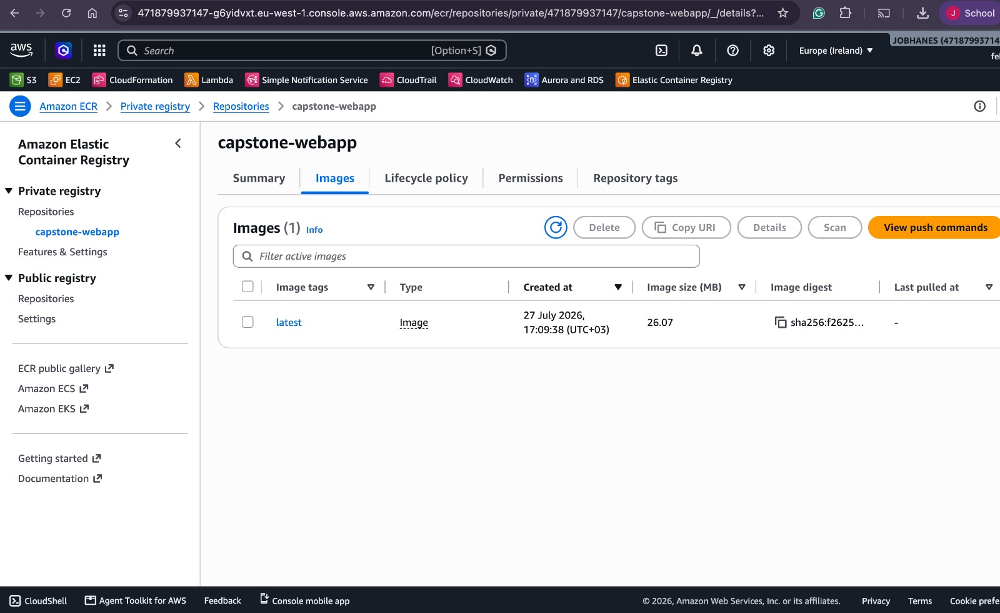

2. **2 - Ran the Docker file to initialised the nginx**

	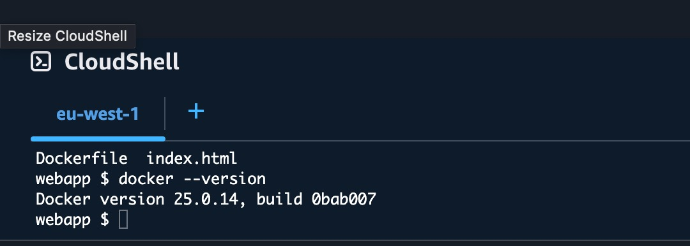

3. **3 - Building Nginx from the dockerfile**

	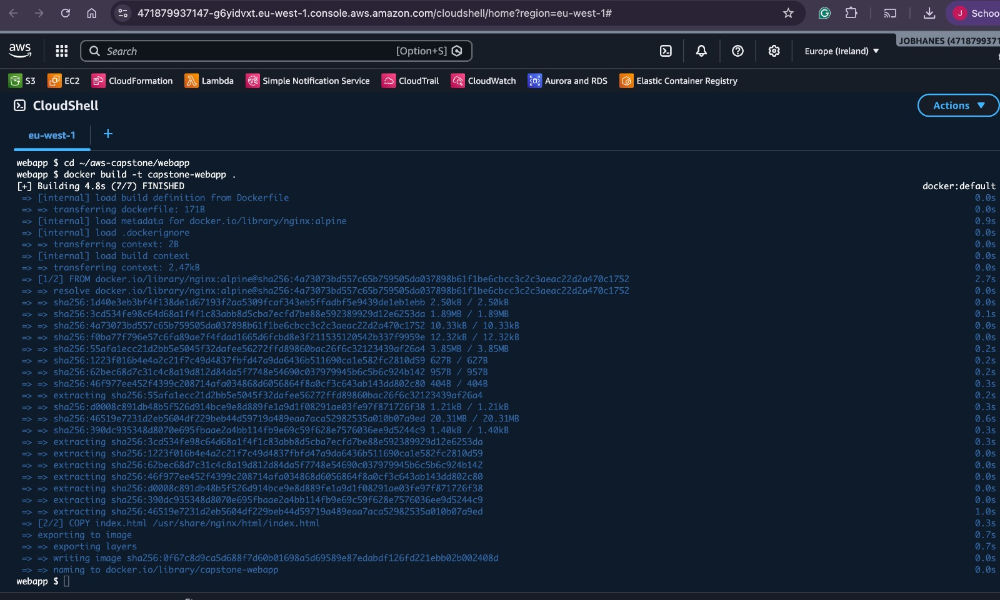

4. **4 - ECR details**

	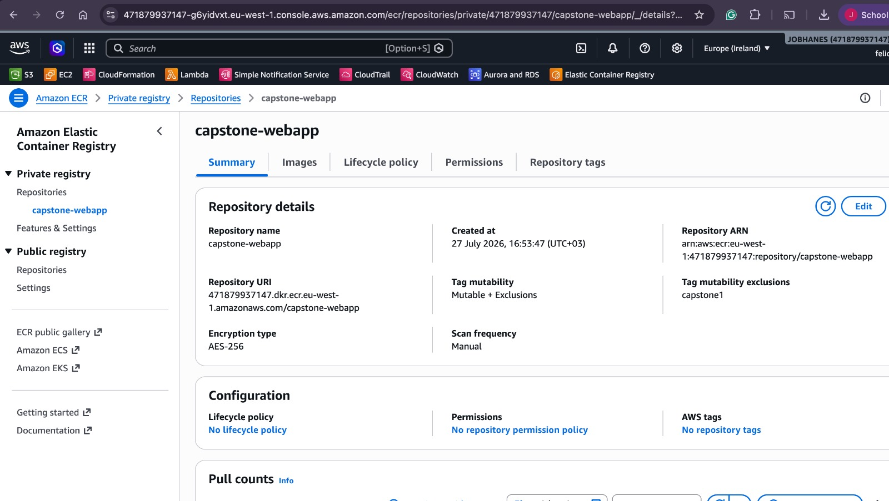

5. **5 - S3 bucket files that I am using**

	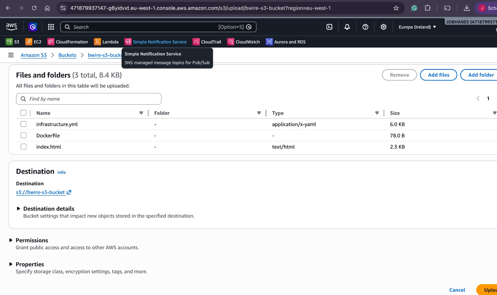

6. **6 - Created stack that shows me the website - URl**

	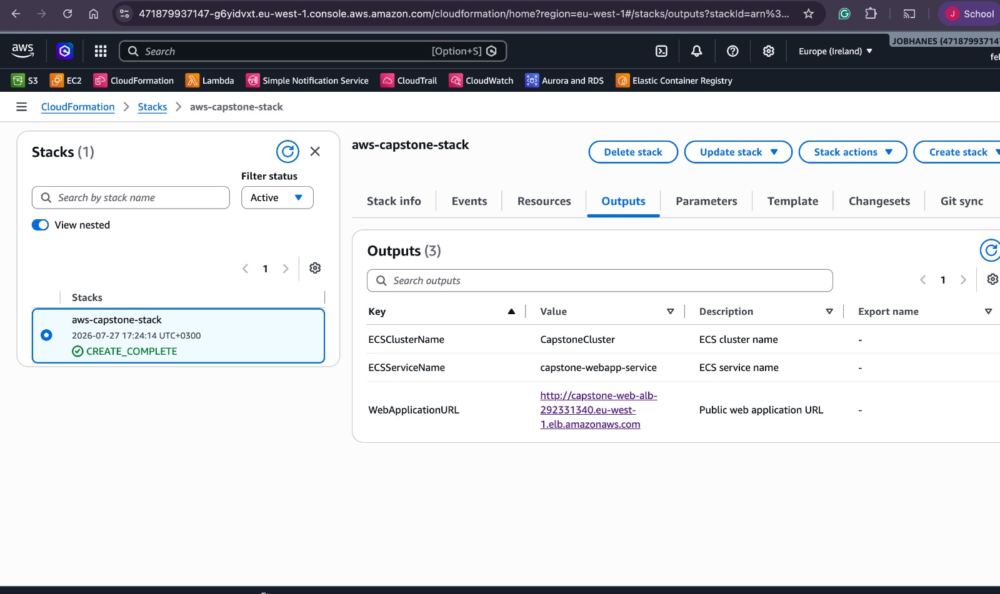

7. **7 - web-url-of-website-created**

	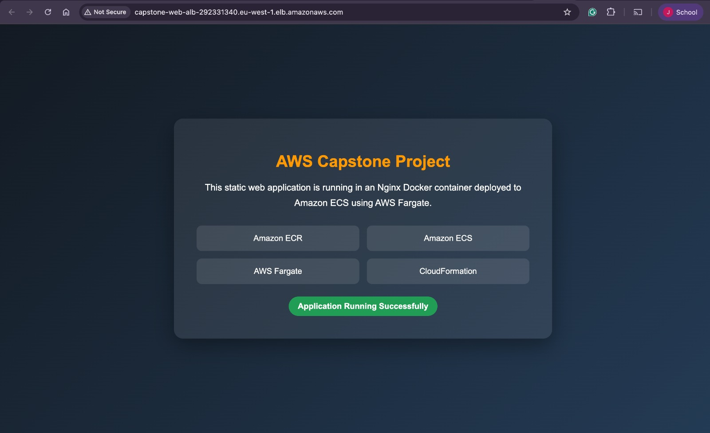

8. **8 - ECS Cluster Running**

	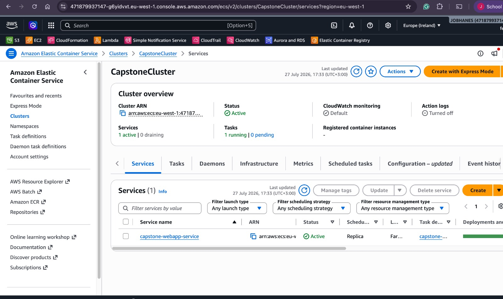

9. **9 - ECS service, task and all the descriptions**

	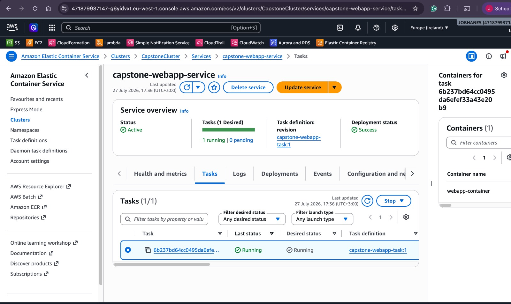

10. **10 - Lambda Function Tested and working as expected**

	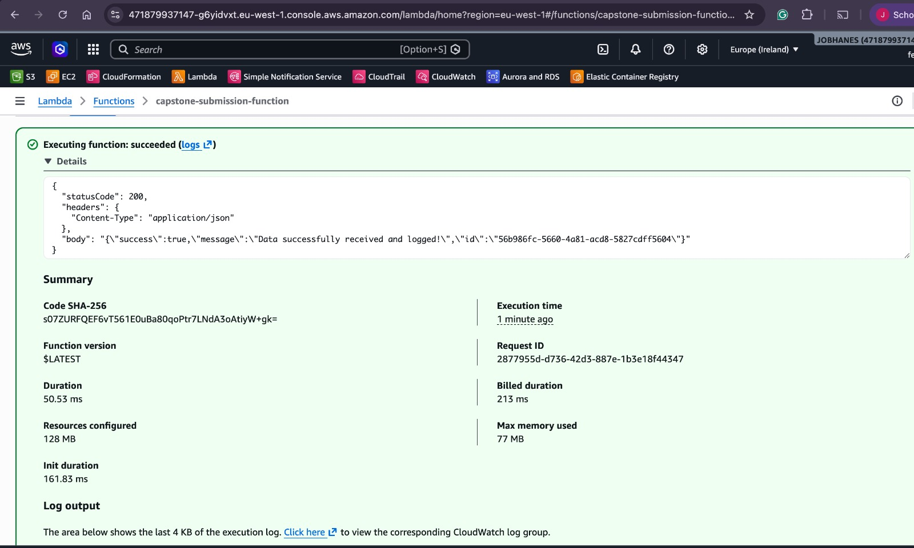

11. **11 - Instead of PostMan-API clients I used AWS API**

	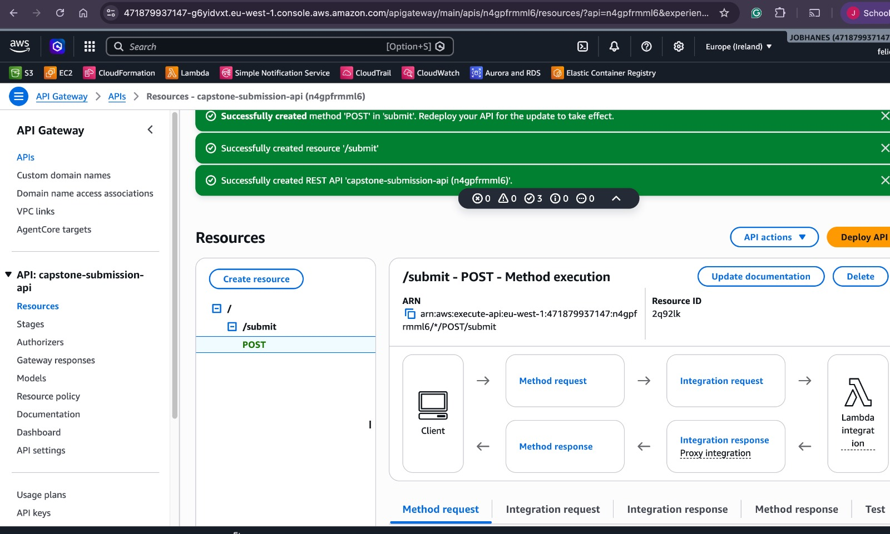

12. **12 - API Tests were successful**

	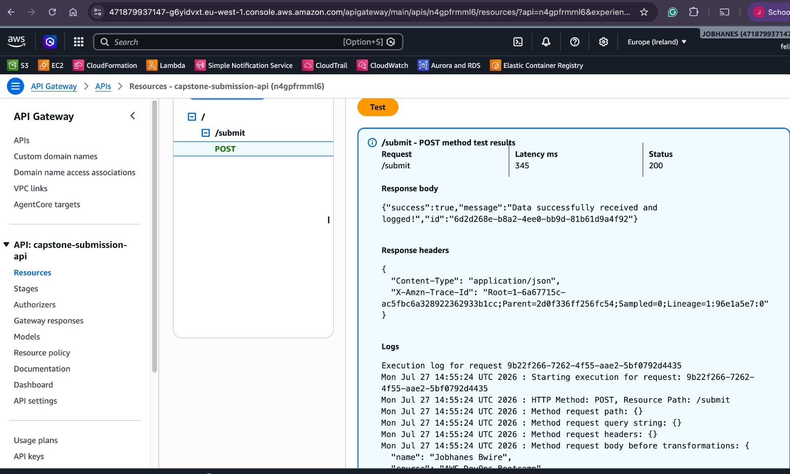

13. **13 - Cloudwatch - Logs monitors**

	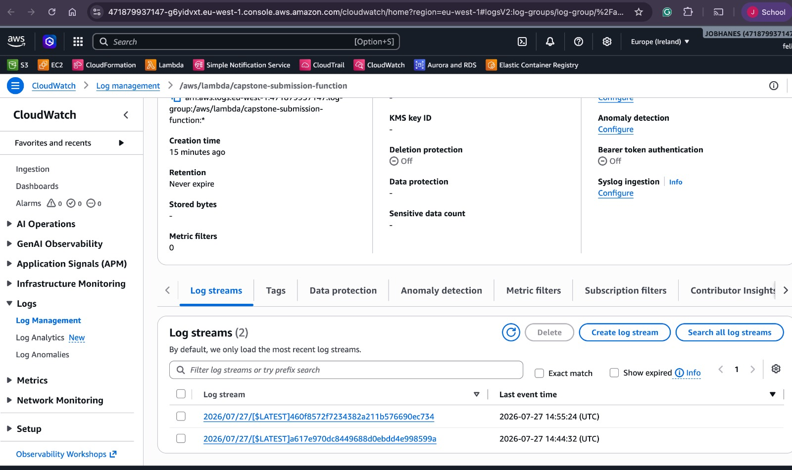

14. **14 - Cloud-watch Dashboard**

	

15. **15 - Error Tests on my lambda function to set the monitors in the dashboard**

	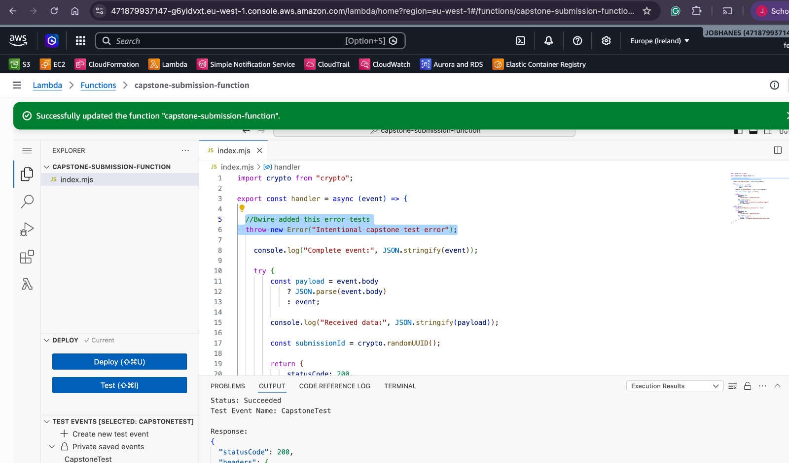

16. **16 - Dashboard created to monitor errors and invocations**

	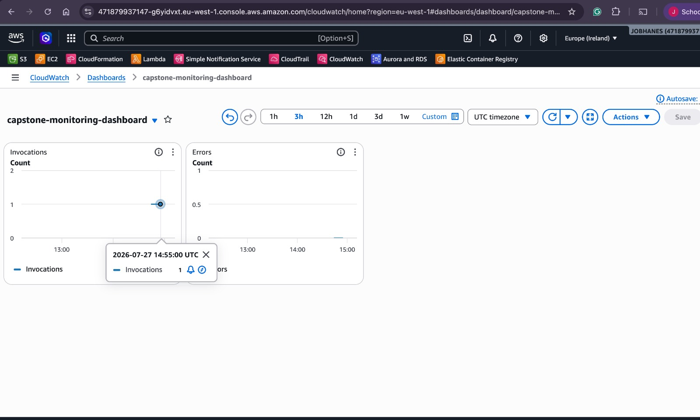

